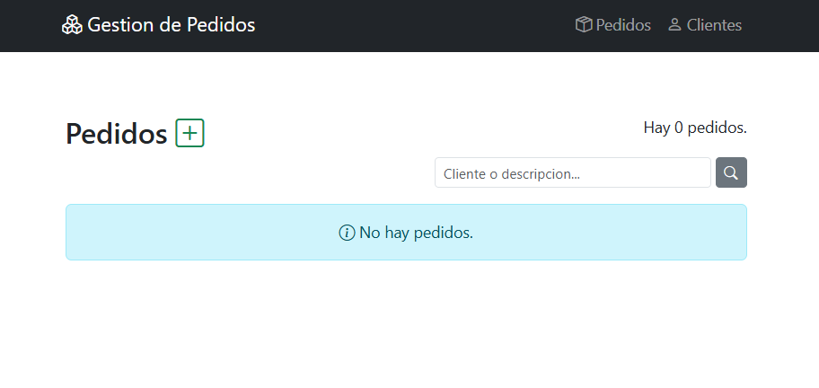
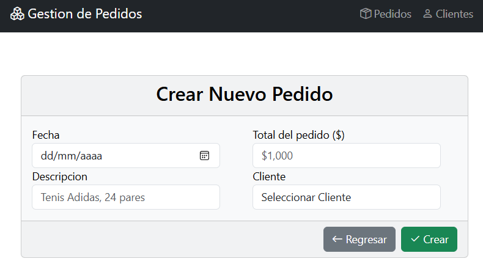
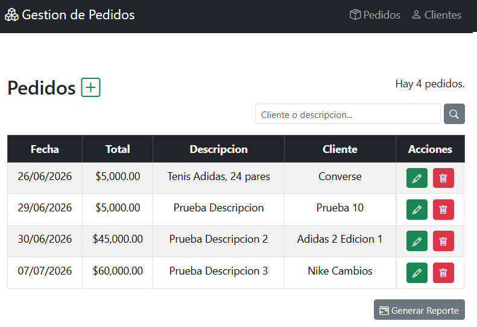
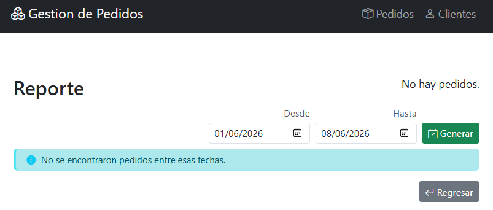
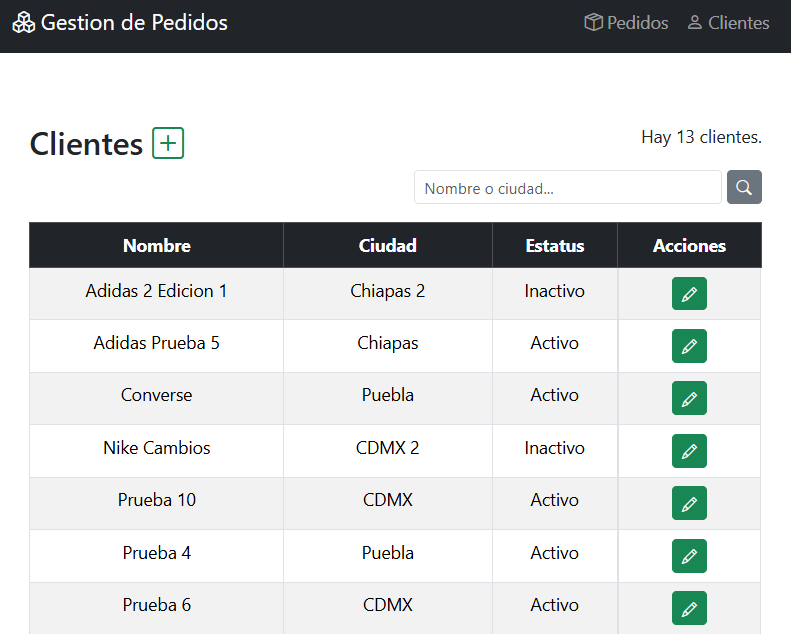

# Gestor de Pedidos - MVC + WCF

Sistema de gestión de pedidos desarrollado con **ASP.NET MVC 5**, **WCF (SOAP)**, **Entity Framework 6 (Database First)** y **SQL Server**.

La aplicación implementa una arquitectura multicapa donde la interfaz MVC consume servicios WCF para acceder a la lógica de negocio y a la capa de datos, promoviendo la separación de responsabilidades y el desacoplamiento entre componentes.

---

## Tecnologías

- **Framework:** ASP.NET MVC 5 (.NET Framework 4.8.1)
- **Servicios:** WCF (Windows Communication Foundation - SOAP)
- **ORM:** Entity Framework 6 (Database First)
- **Base de datos:** SQL Server
- **Frontend:** Bootstrap 5, HTML, CSS, JavaScript
- **Lenguaje:** C#
- **Arquitectura:** MVC + WCF + Business + Data + Entity + DTOs

---

## Funcionalidades

- $\checkmark$ CRUD completo de Clientes.
- $\checkmark$ CRUD completo de Pedidos.
- $\checkmark$ Comunicación mediante servicios WCF SOAP.
- $\checkmark$ Uso de DTOs para transferencia de datos entre capas.
- $\checkmark$ Búsqueda de clientes por nombre o ciudad.
- $\checkmark$ Búsqueda de pedidos por descripción, total o cliente.
- $\checkmark$ Validaciones en capa de negocio.
- $\checkmark$ Reportes de pedidos por rango de fechas.
- $\checkmark$ Manejo centralizado de errores mediante FaultException.
- $\checkmark$ Interfaz moderna con Bootstrap 5.

---

## Arquitectura

```text
MVC (UI)
    ↓
WCF (SOAP Services)
    ↓
Business (Reglas de Negocio)
    ↓
Data (Acceso a Datos)
    ↓
Entity Framework
    ↓
SQL Server
```

### Flujo de una operación

1. El usuario interactúa con la interfaz MVC.
2. El controlador consume un servicio WCF.
3. El servicio delega la operación a la capa de negocio.
4. La capa de negocio aplica validaciones y reglas.
5. La capa de datos realiza las operaciones sobre SQL Server mediante Entity Framework.
6. Los resultados se transfieren entre capas mediante DTOs.
7. Los errores de negocio son propagados mediante FaultException.

---

## Instalación

### Requisitos previos

- Visual Studio 2019 o superior.
- SQL Server.
- .NET Framework 4.8.1

### Configuración de la Base de Datos

Antes de iniciar la aplicación, debes crear la base de datos ejecutando el script proporcionado:

1. Abre **SQL Server Management Studio (SSMS)**.
2. Conéctate a tu servidor local de SQL Server.
3. Ve a **File > Open > File...** (o presiona `Ctrl + O`) y selecciona el archivo `PedidosClientes.sql`.
4. Asegúrate de que no haya ningún texto seleccionado.
5. Haz clic en el botón **Execute** en la barra de herramientas (o presiona **F5**).
6. Verificar la creación de las tablas `Clientes` y `Pedidos`.

**El script creará:**

- $\checkmark$ Base de datos `GestionPedidos`.
- $\checkmark$ Tablas `Clientes` y `Pedidos`.

### Pasos para ejecutar el proyecto

**1. Clonar el repositorio**

`git clone https://github.com/brandon13-dev/Gestor-Pedidos-WCF.git`

**2. Abrir el proyecto**

Abre el archivo `GestorPedidosWCF.slnx` en Visual Studio.

**3. Configura las credenciales**

El proyecto utiliza Entity Framework con conexion a SQL Server.

**IMPORTANTE:** El archivo `Web.config` y `App.config` contiene credenciales reales y NO está subido al repositorio por seguridad.

Para configurar el entorno:

# Copia la plantilla de configuración del Web.config

`cp Gestor-Pedidos-Service/Web.config.template Gestor-Pedidos-Service/Web.config`

Luego edita `Gestor-Pedidos-Service/Web.config` y reemplaza los placeholders con tus credenciales dentro de la etiqueta `<connectionStrings>` (data source, initial catalog, user id, password).

# Copia la plantilla de configuración del App.config

`cp Entity/App.config.template Entity/App.config`

Luego edita `Entity/App.config` y reemplaza los placeholders con tus credenciales dentro de la etiqueta `<connectionStrings>` (data source, initial catalog, user id, password).

**4. Restaurar paquetes NuGet**

Visual Studio restaurará automáticamente los paquetes necesarios. Si no, ejecuta:

`Update-Package -reinstall`

**5. Ejecuta el proyecto**

- Presiona `F5` para iniciar el servicio WCF y la aplicación MVC.
- Si no se ejecutan ambos proyectos realiza lo siguiente:
  1. Haz clic derecho en la solución → **Set StartUp Projects...**
  2. Selecciona **"Multiple startup projects"**
  3. Configura ambos proyectos en **"Start"**:
  - `Gestor-Pedidos-Web` → Start
  - `Gestor-Pedidos-Service` → Start
  4. Presiona **F5**

---

## Estructura del proyecto

```text
GestorPedidosWCF/
├── 1.Web/
│   └── Gestor-Pedidos-Web/                # Capa de presentación (MVC)
│       ├── Connected Services/            # Referencias a los servicios
│       │   ├── PedidoService              # Servicio de Pedidos
│       │   └── ClienteService             # Servicio de Clientes
│       ├── Controllers/                   # Controladores
│       │   ├── PedidosController.cs       # Controlador de Pedidos
│       │   └── ClientesController.cs      # Controlador de Clientes
│       ├── Views/                         # Vistas Razor
│       │   ├── Pedidos/                   # Vistas de Pedidos
│       │   └── Clientes/                  # Vistas de Clientes
│       ├── Content/                       # Archivos CSS (Bootstrap)
│       ├── Scripts/                       # Archivos JavaScript
│       ├── Web.config                     # Configuración local (NO subido a GitHub)
│       └── Web.config.template            # Plantilla de configuración (SÍ subida)
├── 2.WCF/
│   └── Gestor-Pedidos-Service/            # Capa de presentación (MVC)
│       ├── Contracts/                     # Contrato del servicio
│       │   ├── IClientesService.cs        # Contrato para Clientes
│       │   └── IPedidosService.cs         # Contrato para Pedidos
│       └── Services/                      # Implementacion del servicio
│           ├── ClientesService.svc        # Servicio para Clientes
│           └── PedidosService.cs          # Servicio para Pedidos
├── 3.Business/
│   └── Business/                          # Capa de negocio (Lógica de validación)
│       ├── BusinessPedidos.cs             # Reglas de negocio para pedidos
│       └── BusinessClientes.cs            # Reglas de negocio para clientes
├── 4.Data/
│   └── Data/                              # Capa de datos (Acceso a BD)
│       ├── DataPedidos.cs                 # Operaciones CRUD de pedidos
│       └── DataClientes.cs                # Operaciones CRUD de clientes
├── 5.Entity/
│   └── Entity/                            # Modelo de datos (Entity Framework)
│       ├── Models/
│       │   └── ModelPedidosClientes.edmx  # Modelo EDMX
│       ├── App.config.template            # Plantilla de configuración (SÍ subida)
│       └── App.config                     # Configuración local (NO subido)
├── 6.Shared/
│   └── Shared/                            # Modelo de datos (Entity Framework)
│       └── DTOs/                          # Data Transfer Objects
│           ├── ClientesDTO                # DTO para la entidad Clientes
│           └── PedidosDTO                 # DTO para la entidad Pedidos
├── Scripts/
│   └── PedidosClientes.sql                # Script para generar la base de datos
├── GestorPedidosWCF.slnLaunch             # Configuracion compartida
├── packages/                              # Paquetes NuGet
└── README.md                              # Documentación del proyecto
```

---

## Conceptos Aplicados

- Arquitectura multicapa.
- Patrón MVC.
- Servicios SOAP mediante WCF.
- DTOs (Data Transfer Objects).
- Entity Framework Database First.
- Separación de responsabilidades.
- Manejo de excepciones.
- Validaciones de negocio.
- Relaciones entre entidades.
- Consumo de servicios desde clientes MVC.

---

## Capturas de pantalla

### Pantalla de Pedidos Vacía



### Pantalla de Crear Pedido



### Pantalla de Crear Pedido con error


### Pantalla de Pedido creado correctamente


### Pantalla de Lista de Pedidos



### Pantalla de reporte de Pedidos


### Pantalla de reporte de Pedidos vacía



### Pantalla de lista de Clientes



### Pantalla de Crear Cliente


### Pantalla de Editar Cliente


## Notas adicionales

### Próximas mejoras

- [ ] Generación de reportes en PDF
- [ ] Exportación a Excel
- [ ] Autenticación de usuarios
- [ ] Roles y permisos
- [ ] Dashboard con estadísticas
- [ ] HTTPS en WCF
